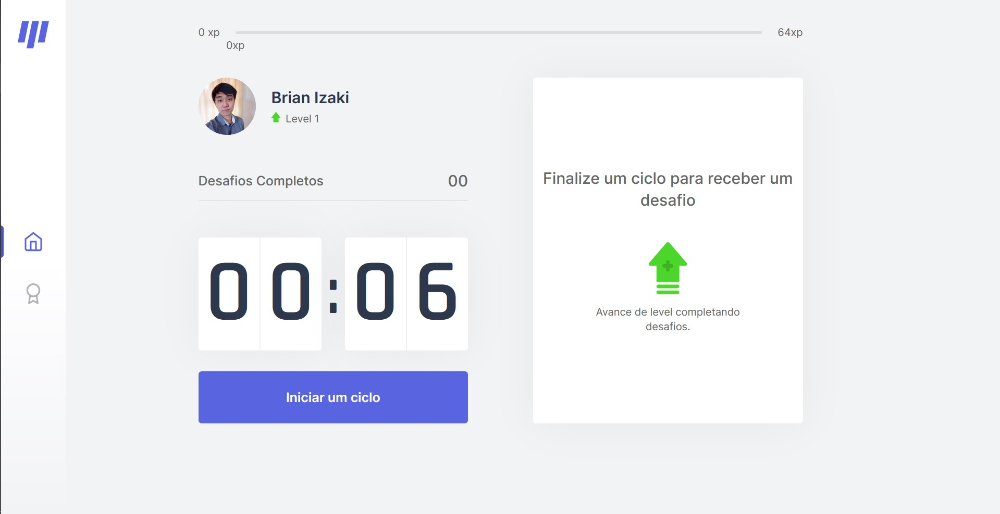
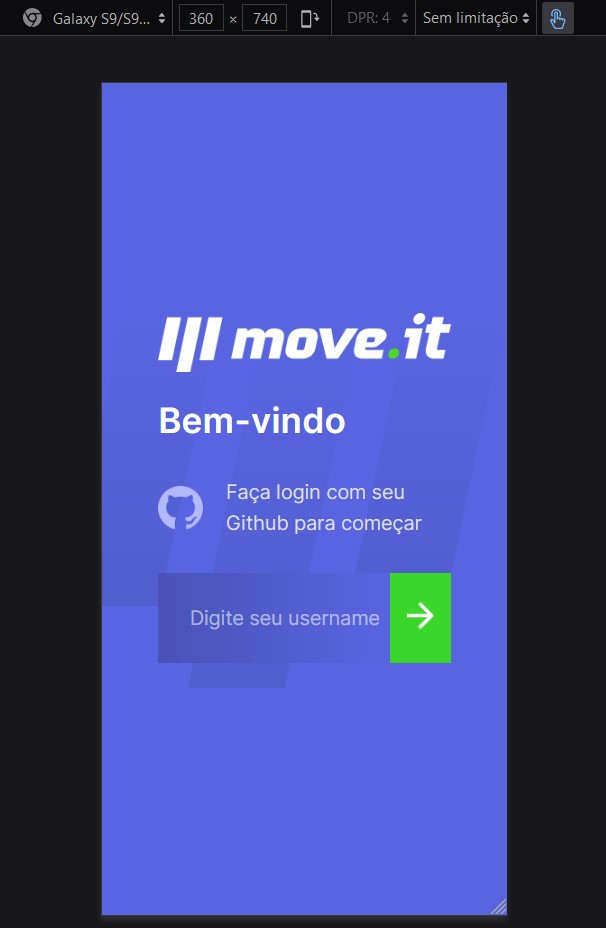
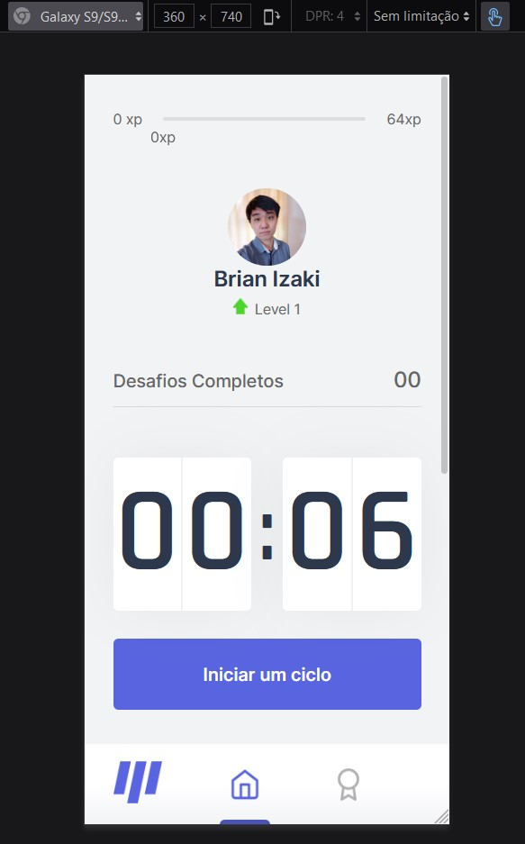

# Next Level Week 04 da Rocketseat

Desenvolvido uma aplicação com a temática da técnica Pomodoro para melhorar a concentração e realizar alongamentos enquanto fica na frente do computador. Nele foi utilizado uma estratégia de gamificação na qual o usuário obtém pontos ao realizar tarefas que se apresentam quando é o momento de descanso.

_obs: a técnica Pomodoro consiste em se focar em uma tarefa por um 25min(chamado de pomodoro) e então ter um intervalo de 5min para descansar e depois voltar para a tarefa com o mesmo tempo, a cada 4 ou 5 pomodoros pode ter um descanso de 30min e depois iniciar um novo ciclo._

---
## Screenshots




<br />



*layout baseado no [Figma 2.0 do Tiago Luchtenberg](https://www.figma.com/file/WPOPVXfc1UWXYpV6P6URDT/Move.it-2.0-Copy?node-id=160%3A2761), apenas a página de login foi customizado o layout para mobile*

<br />

---

## Ambiente de desenvolvimento

- Node versão LTS (ou maior) instalado;

---

## Utilizado

- React com Typescript
- Next.js
- Eslint
- js-cookie (utilizado para facilitar a utilização de cookies na aplicação)
- mongoDB (para armazenar os usuários que se logaram e mostrar na leaderboard)

---

## Executar aplicação localmente

1. Clonar esse repositório
2. Abrir o terminal com o caminho da pasta clonada
3. Executar o comando `npm install`
4. Esperar a instalação e então executar `npm run dev`
5. Acessar no navegador o link http://localhost:3000

---

## Dia 01

- Visto:

  - Funcionamento do React: componentes, estados;
  - Typescript: tipagem estática, novas features para turbinar o JS;

- Desenvolvido:
  - barra de xp do layout
  - CSS com variáveis globais na `:root`

---

## Dia 02

- Visto:

  - Next.js

    - Framework para React.
    - **Single Page Application (SPA)**: aplicação de uma página, não atualiza a página inteira;
    - **Server Side Rendering (SSR)**: a aplicação tem sua renderização no servidor, assim, entregando html e css para o client;
    - **Static Site Generation (SSG)**: HTML, CSS, JS puro, gera uma página estática dentro do servidor que entrega ele para vários _clients_ a mesma página, e após um tempo determinado atualiza a página no server assim, entregando a página nova para todos novamente.

  - **CSS modules**: o next ajuda no css isolando os nomes das classes, assim podendo duplicar nomes em outros componentes. Para isso, é necessário um arquivo `nome_arquivo.module.css` e realizar a importação dele no componente, assim, na tag passar `className={ nome_importacao.nome_ClasseCSS }`

- Desenvolvido:

  - Migração para o Next.js

    - passado as pastas components e styles

  - Criado o arquivo `_document.tsx`, nele foi adicionado as tags do head do HTML (não foi adicionado no `_app.tsx` pois nele é recalculado e isso pode carregar os scripts de fontes do google mais d uma vez)

    - _obs_:
      - ele carrega apenas uma vez quando o uauário acessa a página.
      - colocar tudo o que for estático

  - Criado componente Countdown, Profile e CompletedChallenges

---

## Dia 03

- Visto:

  - **Context Hook**: Formas de compartilhar comunicação entre vários componentes na aplicação.
    - Para utilizar ele é necessário importar o `useContext()` do React, dentro pode ser passado qualquer coisa (string, number, objetos, etc)
    - Uma variável com o `useContext` pode ser utilizada como um componente;
    - Para passar os valores de um contexto é necessário extender com o `.Provider` e passar os valores ao atributo `value={valores_desejados}`
    - ```JavaScript
      // EXEMPLO
      const Contexto = useContext({})
      <Contexto.Provider value={{valor1: 1, valor2: 2}}>
        <Componentes_que_podem_user_esse_contexto>
      </Contexto.Provider>
      ```

- Feito:
  - Regras de negócio para aparecer os desafios e xp de usuários;
  - utilizado o `useContext` para gerenciar os estados entre os componentes;

---

## Dia 04

- Visto:

  - Quando perceber que é necessário utilizar uma variável ou função de determinado componente, é interessante pensar em criar um novo contexto.
  - O contexto depende para qual funcionalidade será utilizada, algumas vezes um contexto não será utilizado na aplicação toda, assim, podendo colocar ele em uma parte específica do código que fará uso dele (ex: o `CountdownProvider` não tinha necessidade de estar no `_app.tsx`, logo, ele foi colocado apenas na prágina `index.tsx`)
    - (_obs: caso faça uso de dois contextos deve pensar qual fará uso de qual, uma que não faz uso de nenhuma está no topo da hierarquia, uma que faz uso de "A" estará abaixo dela, assim em diante_ )
  - `Notification` é uma [API nativa do browser](https://developer.mozilla.org/pt-BR/docs/Web/API/notificacoes), assim como no nome, ele envia notificações (antes é necessário que o usuário conceda permissão)
    - (_obs: ele ainda [não é suportado](https://caniuse.com/mdn-api_notification) em todos os browsers_)
  - `Audio` outra [API nativa do browser](https://developer.mozilla.org/en-US/docs/Web/API/HTMLAudioElement/Audio), com ele é possível tocar uma música. [ele tem amplo suporte](https://caniuse.com/mdn-api_htmlaudioelement_audio)

- Feito:
  - Separado a lógica do Countdown para criar um novo context, pois algumas das informações dele eram necessárias no ChallengeBox

---

## Dia 05

- Visto:

  - Utilização de cookies para a aplicação, pois, o Next.js renderiza a View no servidor e o localStorage seria mais voltado para o client-side, enquanto que o cookie pode ser utilizado nos dois lados, client e server.

  - Algumas libs (js-cookies) são feitas puramente com o JavaScript, com isso, quando é desenvolvido uma aplicação em typescript, a lib acaba não tendo as tipagens e acaba dando um warning sobre a lib. Para resolver este problema existe uma lib de terceiros desenvolvido pela comunidade chamada [DefinitelyTyped](https://github.com/DefinitelyTyped/DefinitelyTyped) nela existe as tipagens onde não tinha na lib original.

  - `getServerSideProps` é uma função nativa do próprio Next, ele permite que **retornos de funções asincronas** sejam renderizadas no HTML enviado para o client. (normalmente, os retornos dessas funções não seriam renderizadas).

  - O operador `??` é chamado de [_null coalescing operator_](https://developer.mozilla.org/en-US/docs/Web/JavaScript/Reference/Operators/Nullish_Coalescing_Operator), ele substitui um ternário caso queira verificar se é um valor nulo (deixa menos verboso).
    - ```JavaScript
      const valorNulo = null
      const temValor = 'teste'
      // null coalescing operator
      console.log(valorNulo ?? 'essa string aparece')
      console.log(temvalor ?? 'essa string NÃO aparece')

      // com ternário
      console.log(valorNulo ? valorNulo : 'essa string aparece')
      console.log(temValor ? temValor : 'essa string NÃO aparece')
      ```

- Feito:

  - instalado a dependência *js-cookie* para facilitar a manipulação dos cookies da aplicação.
  - Utilizado o GetServerSideProps para pegar os cookies da página e renderizar elas quando atualizar a página.
  - Realizado o Deploy da aplicação na Vercel com a CLI.
    - os passos foram: 
      - instalação da CLI `npm i -g vercel`
      - login com `vercel login`
      - deploy com `vecel` (teve confirmação de perguntas durante a execução)

---

## Desafios

- [x] deixar responsivo
- [x] seguir o layout do [Figma 2.0 do Tiago Luchtenberg](https://www.figma.com/file/WPOPVXfc1UWXYpV6P6URDT/Move.it-2.0-Copy?node-id=160%3A2761)
- [x] para logar está sendo utilizado um username do github (os dados são armazenados no mongoDb)
- [x] listar os usuários na página de Leaderboard

---

### Anotações

- Seguido o [code drops](https://www.youtube.com/watch?v=Cz55Jmhfw84) da rocketseat sobre o serverless
  - O Next tem permite criar uma pequena api em node quando a rota da API for chamada ele executa, após a execução o processo em node para. 
  - Existe um termo para essa API no Next, Serverless function
  - Outros termos: [Hot start e Cold start](https://medium.com/@danielmanchev/cold-warm-and-hot-start-in-aws-lambda-bc8d64f28575). Em resumo:
    - cold start: é o momento da execução daquel função, e ele para após o termino do seu processo.
    - hot start: uma ligação entre as funções lambda que se ativa ao receber requisições e que se desliga após um bom tempo não recebendo requisições.

- Feito login de sessão de um usuário utilizando o sessionStorage do navegador (src/pages/index.tsx), o username, name e avatarUrl são pegos da API github.

- Na api de users tem cadastro do usuário que acabou de logar, listagens de usuários e alteraões das challenges (level, xp, e desafios completados)

- Para armazenar os dados de usuários, está sendo utilizado o mongoDB.

- Para gerenciar os estados do usuário foi criado a src/context/UserContext.tsx. O provider dele foi utilizado na _app.tsx